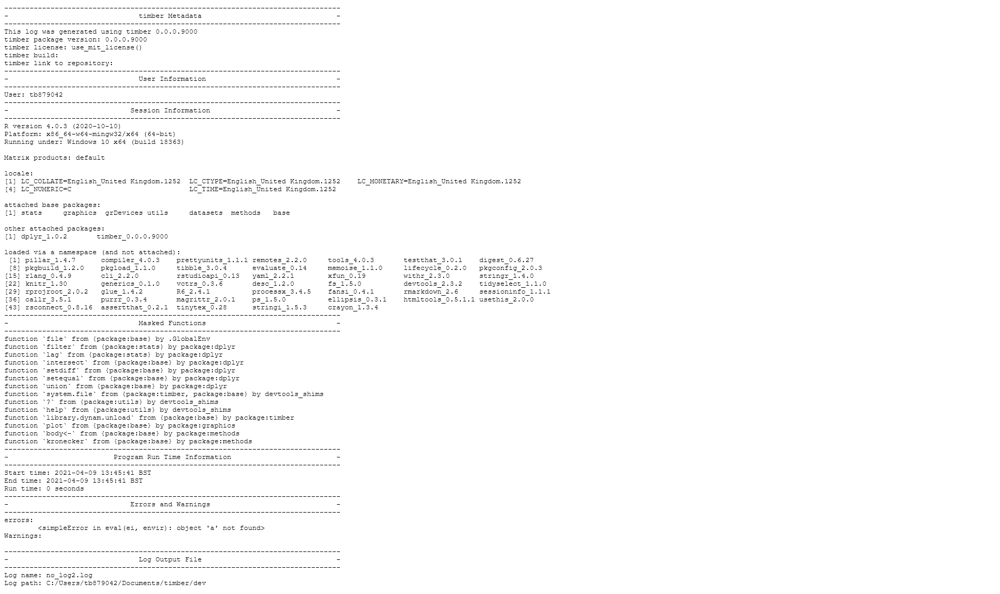

```{r, include = FALSE}
knitr::opts_chunk$set(
  collapse = TRUE,
  comment = "#>"
)
```

```{r setup}
library(timber)
```

The purpose of the `timber` package is to generate a log upon execution of 
an R script which enables traceability and reproducibility of the executed code. 



# Log attributes
The following attributes are recorded in the log:

* `metadata`: The timber `package` information
* `user`: The user that generates the log
* `session_info`: The R session information
* `masked_functions`: The functions masked by packages
* `used_packages`: The used packages
* `start_time`, `end_time`, and `run_time`: The start, end, and run times
* `errors`: The errors generated when running the R script
* `warnings`: The warnings generated when running the R script
* `file_name`, `file_path`: The file name and path of the R script
* `log_name`, `log_path`: The name and path of the log


# Generating a log
The log can be generated according in two ways:

* Using the `axecute()` function

* Using the `log_*()` functions


## `axecute()`
`axecute()` enables the command line submission of a program. A log is 
set-up around the program, and its code is run safely and quietly (using `safely()` and `quietly()` from the `purrr` package).
```{r axecute, eval = FALSE}
axecute("my_script.R")
```


## `log_*()` functions
Use the `log_*()` functions:

* `log_init()` to create the environment timber.log

* `log_config()` to add the core elements of the log to the environment, and 
 basic elements that are available at the time of configuration

* `run_safely_n_quietly()` to execute the program code, and capture errors 
and warnings

* `log_write()` to generate and format the log
```{r log_*, eval = FALSE}
log_config("my_script.R")
run_safely_n_quietly("my_script.R")
log_write()
```

# Scripting with ```timber```
While ```timber``` is built around creating a log for a program it can just as easily be used when running an entire set of programs.  The `axecute()` function has been built with both single file execution and scripted file execution in mind.  With the use of simple functions such as `lapply()` scripting is easy.  Below is some sample code of how `lapply()` can be used with `axecute()`.

```{r scripting, eval = FALSE}
lapply(c("file.R", "otherfile.R"), axecute)
```

If your scripting needs to work on the contents of a directory instead of a pre-defined list, functions such as `list.files` can be used to obtain a list of files to use.  Below is an example of how this can be applied in practice by getting all files ending in '.R' in the current working directory using a regular expression, and then using `lapply()` to run the files using `axecute()`.

```{r scripting-dir, eval = FALSE}
r_script_list <- list.files(path = ".", pattern = "\\.R$")
lapply(r_script_list, axecute)
```

